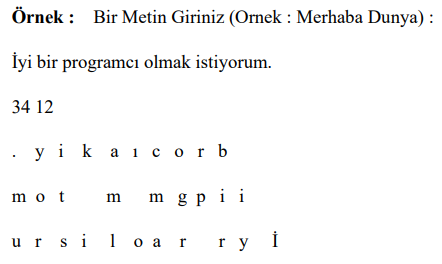
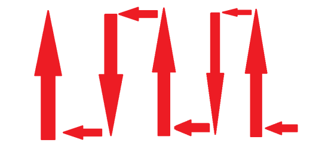

Task-2

In this task, our goal is to receive a string from the user and use this string that we have developed ourselves.
encrypting with the encryption algorithm and deciphering this string that we have encrypted again,
was to print.

• First we ask the user to enter some text.

• We calculate the length of this entered text.

• The number of columns of the matrix we will create the length of the text we have calculated. We use it to calculate.

•  Then the number of rows of the entered text is 3 and the number of columns is
We place it in a matrix that changes depending on its length.

**Example Algorithm**

  

Example matrix

 

  

We write text to a matrix with this route.

 

  

We do encryption starting from the upper left corner of the matrix.